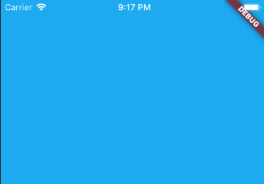
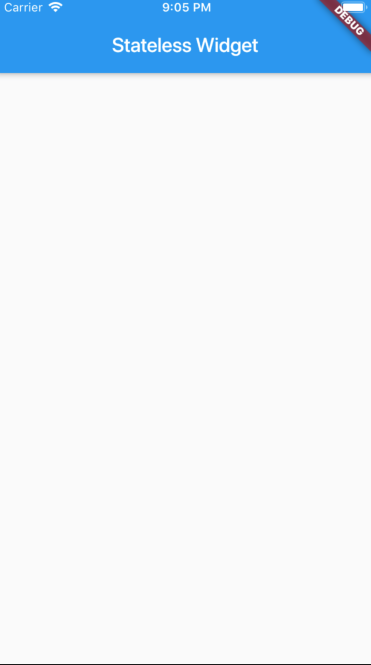
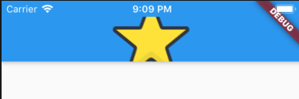
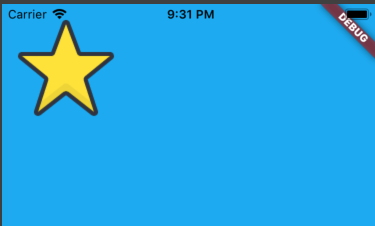
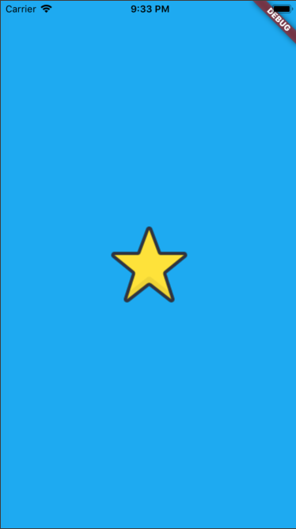
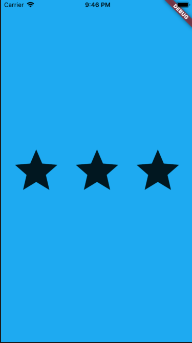
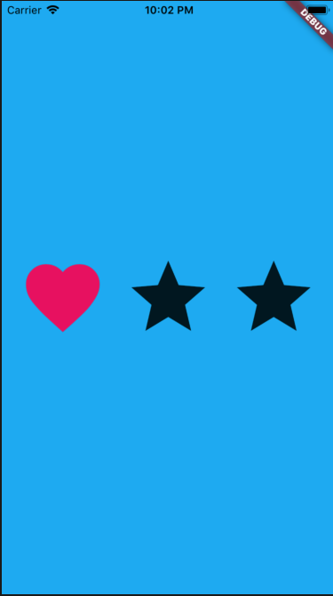

# Các bước thực hành một Stateless Widget App

Stateless Widget không chứa trạng thái nào có thể thay đổi trong lúc app chạy


## Empty app
```dart
import 'package:flutter/material.dart';

void main() => runApp(MyApp());

class MyApp extends StatelessWidget {
  @override
  Widget build(BuildContext context) {
    return MaterialApp(
      title: 'Layout demo',
      home: Scaffold (        
      )
    );
  }
}
```
## Thay Background color
```dart
class MyApp extends StatelessWidget {
  @override
  Widget build(BuildContext context) {
    return MaterialApp(
      title: 'Layout demo',
      home: Scaffold (
        backgroundColor: Colors.lightBlue,       
      )
    );
  }
}
```

## Thêm AppBar
```dart

  @override
  Widget build(BuildContext context) {
    return MaterialApp(
      title: 'Layout demo',
      home: Scaffold (
        appBar: AppBar(title: Text("Stateless Widget"),),
      )
    );
  }
}
```


## Thay AppBar bằng ảnh
```dart
class MyApp extends StatelessWidget {
  @override
  Widget build(BuildContext context) {
    return MaterialApp(
      title: 'Layout demo',
      home: Scaffold (
        appBar: AppBar(title: Image.asset("images/star.png"),),
      )
    );
  }
}
```


## body property
```dart
class MyApp extends StatelessWidget {
  @override
  Widget build(BuildContext context) {
    return MaterialApp(
        title: 'Layout demo',
        home: Scaffold (
          backgroundColor: Colors.lightBlue,
          body: Image.asset("images/star.png") //Bổ xung thêm body
        )
    );
  }
}
```


## body_center
```dart
class MyApp extends StatelessWidget {
  @override
  Widget build(BuildContext context) {
    return MaterialApp(
        title: 'Layout demo',
        home: Scaffold (
          backgroundColor: Colors.lightBlue,
          body: Center(
            child: Image.asset("images/star.png")
          )
        )
    );
  }
}
```


## Row
```dart
class MyApp extends StatelessWidget {
  @override
  Widget build(BuildContext context) {
    return MaterialApp(
        title: 'Layout demo',
        home: Scaffold (
          backgroundColor: Colors.lightBlue,
          body: Center(
            child: Row /*or Column*/(
              mainAxisAlignment: MainAxisAlignment.spaceEvenly,
              children: <Widget>[
                Icon(Icons.star, size: 100),
                Icon(Icons.star, size: 100),
                Icon(Icons.star, size: 100),
              ],
            ),
          )
        )
    );
  }
}
```

## Icons
```dart
children: <Widget>[
    Icon(Icons.favorite, color: Colors.pink, size: 100),
    Icon(Icons.star, size: 100),
    Icon(Icons.star, size: 100),
],
```
