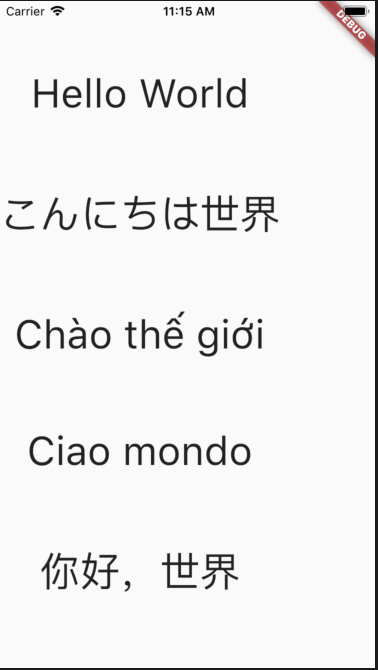
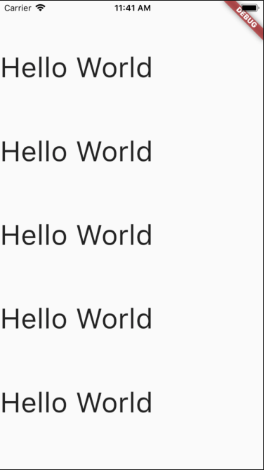
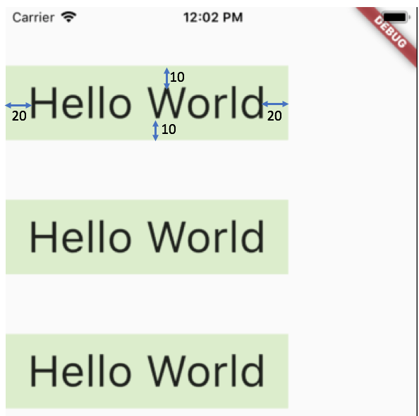
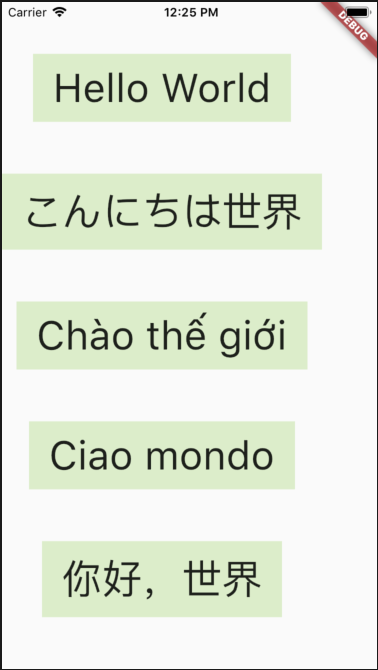
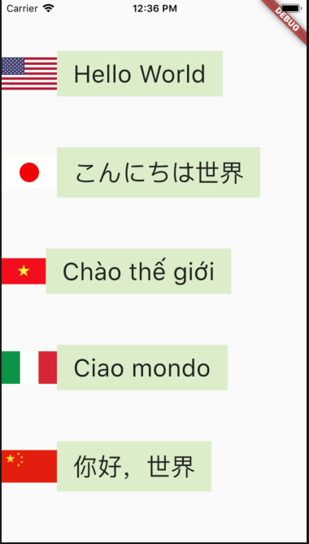
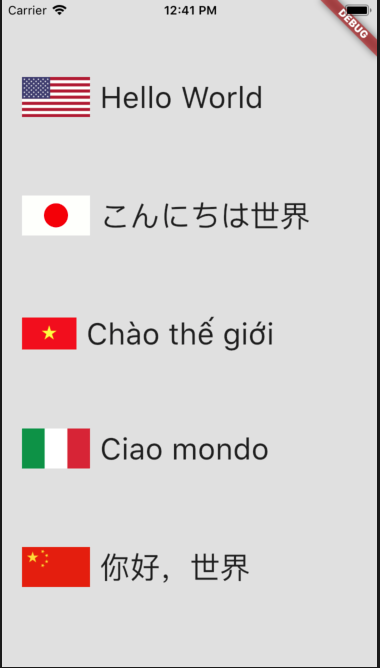

# 07_custom_stateless_widget

Bài này sẽ hướng dẫn từng bước tạo Custom Stateless Widget.
Ở bài trước chúng ta đã hiểu Stateless Widget có trạng thái không thay đổi lúc run-time.
Tuy nhiên lúc khởi tạo Stateless Widget chúng ta vẫn có thể truyền vào tham số.

## 01 Tạo một danh sách Text widget tối giản

Code ban đầu không thể dễ hơn
```dart
import 'package:flutter/material.dart';

void main() => runApp(MyApp());

class MyApp extends StatelessWidget {
  @override
  Widget build(BuildContext context) {
    return MaterialApp(
        home: Scaffold (
        )
    );
  }
}
```
Tạo một Widget Text ở giữa màn hình
```dart
class MyApp extends StatelessWidget {
  @override
  Widget build(BuildContext context) {
    return MaterialApp(
        home: Scaffold(
          body: Center(
              child: Text("Hello World", style: TextStyle(fontSize: 40)
              )
          ),
        ));
  }
}
```

## 02 Tạo column nhiều Text Widget
```dart
class MyApp extends StatelessWidget {
  @override
  Widget build(BuildContext context) {
    return MaterialApp(
        home: Scaffold(
          body: Column (
            mainAxisAlignment: MainAxisAlignment.spaceEvenly,
            children: <Widget>[
              Text("Hello World", style: TextStyle(fontSize: 40)),
              Text("こんにちは世界", style: TextStyle(fontSize: 40)),
              Text("Chào thế giới", style: TextStyle(fontSize: 40)),
              Text("Ciao mondo", style: TextStyle(fontSize: 40)),
              Text("你好，世界", style: TextStyle(fontSize: 40))
            ],
          )
        ));
  }
}
```
Kết quả


## 03 Mở Flutter Inspector ra để xem cấu trúc cây Widget


## 04 Tạo MyWidget
```dart
class MyApp extends StatelessWidget {
  @override
  Widget build(BuildContext context) {
    return MaterialApp(
        home: Scaffold(
          body: Column (
            mainAxisAlignment: MainAxisAlignment.spaceEvenly,
            children: <Widget>[
              MyWidget(),
              MyWidget(),
              MyWidget(),
              MyWidget(),
              MyWidget(),
            ],
          )
        ));
  }
}

class MyWidget extends StatelessWidget {
  @override
  Widget build(BuildContext context) {
    return Text("Hello World", style: TextStyle(fontSize: 40));
  }
}
```
Kết quả ra thế này


## 05 Thêm Container để bao lấy Text cách lề, màu nền
```dart
class MyWidget extends StatelessWidget {
  @override
  Widget build(BuildContext context) {
    return Container(
      child: Text("Hello World", style: TextStyle(fontSize: 40)),
      padding: EdgeInsets.fromLTRB(20, 10, 20, 10),
      color: Colors.lightGreen[100],
    );
  }
}
```

Xem thêm [Flutter Padding Widget](https://www.youtube.com/watch?v=c1xLMaTUWCY)

## 06 Truyền tham số vào MyWidget
```dart
class MyApp extends StatelessWidget {
  @override
  Widget build(BuildContext context) {
    return MaterialApp(
        home: Scaffold(
            body: Column(
              mainAxisAlignment: MainAxisAlignment.spaceEvenly,
              children: <Widget>[
                MyWidget("Hello World"),
                MyWidget("こんにちは世界"),
                MyWidget("Chào thế giới"),
                MyWidget("Ciao mondo"),
                MyWidget("你好，世界")
              ],
            )));
  }
}

class MyWidget extends StatelessWidget {
  MyWidget(this.title);
  final String title;

  @override
  Widget build(BuildContext context) {
    return Container(
      child: Text(title, style: TextStyle(fontSize: 40)),
      padding: EdgeInsets.fromLTRB(20, 10, 20, 10),
      color: Colors.lightGreen[100],
    );
  }
}
```


## 07 Thêm ảnh vào bên trái text

```dart
class MyApp extends StatelessWidget {
  @override
  Widget build(BuildContext context) {
    return MaterialApp(
        home: Scaffold(
            body: Column(
              mainAxisAlignment: MainAxisAlignment.spaceEvenly,
              children: <Widget>[
                MyWidget("Hello World", "us"),
                MyWidget("こんにちは世界", "jp"),
                MyWidget("Chào thế giới", "vn"),
                MyWidget("Ciao mondo", "it"),
                MyWidget("你好，世界", "cn"),
              ],
            )));
  }
}

class MyWidget extends StatelessWidget {
  MyWidget(this.title, this.country);
  final String title;
  final String country;

  @override
  Widget build(BuildContext context) {
    return Row (
        mainAxisAlignment: MainAxisAlignment.start,
        children: <Widget>[
          Image.asset("images/" + this.country +".png", scale: 3,),
          Container(
            child: Text(title, style: TextStyle(fontSize: 30)),
            padding: EdgeInsets.fromLTRB(20, 10, 20, 10),
            color: Colors.lightGreen[100],
          ),
        ]
    );
  }
}
```


## 07 Thêm Container bao ngoài Column để tạo padding
```dart
class MyApp extends StatelessWidget {
  @override
  Widget build(BuildContext context) {
    return MaterialApp(
        home: Scaffold(
          backgroundColor: Colors.grey[300],
            body: Container(
                child: Column(
                  mainAxisAlignment: MainAxisAlignment.spaceEvenly,
                  children: <Widget>[
                    MyWidget("Hello World", "us"),
                    MyWidget("こんにちは世界", "jp"),
                    MyWidget("Chào thế giới", "vn"),
                    MyWidget("Ciao mondo", "it"),
                    MyWidget("你好，世界", "cn"),
                  ],
                ),
                padding: EdgeInsets.fromLTRB(20, 10, 20, 10)
            )
        ));
  }
}

class MyWidget extends StatelessWidget {
  MyWidget(this.title, this.country);

  final String title;
  final String country;

  @override
  Widget build(BuildContext context) {
    return Row(mainAxisAlignment: MainAxisAlignment.start, children: <Widget>[
      Image.asset(
        "images/" + this.country + ".png",
        scale: 3,
      ),
      Container(
        child: Text(title, style: TextStyle(fontSize: 30)),
        padding: EdgeInsets.fromLTRB(10, 10, 10, 10),
      ),
    ]);
  }
}
```
