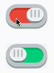

# MySwitch - Tạo một Stateful Widget

Mấy điểm cần chú ý:
1. Flutter Widget không thay đổi được thuộc tính () khi đã xuất ra màn hình. 
Điều này khác hoàn toàn với IOS và Android.

2. Để thay đổi thuộc tính của widget cần:
- Tạo Stateful Widget
- Thay đổi trạng thái bên trong class State của Stateful Widget

