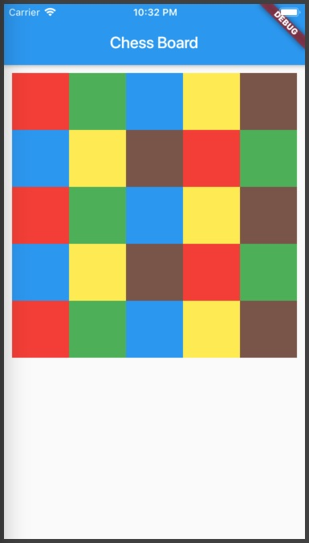

# chess_board

Mục tiêu hãy lập trình ứng dụng như sau. Bài này chủ yếu luyện kỹ năng lay out


## Phân tích vấn đề

1. Cần tạo các ô hình vuông nằm sát nhau, tạo thành một khối cách biên màn hình một khoảng cách vừa phải.
2. Chiều rộng các ô hình vuông này cần phải tự điều chỉnh theo chiều rộng của màn hình thiết bị, và số lượng ô vuông nhập vào.

## Giải quyết

1. Để vẽ một ô vuông có màu, sử dụng Container
```dart
Container(
  color: this.color,
  width: 40,
  height: 40
)
```

2. Để các ô chữ nhật tự điền đầy khoảng không gian cho phép sử dụng Flexible

3. Để các ô chữ nhật biến thành hình vuông tỷ lệ width/height=1
sử dụng AspectRatio